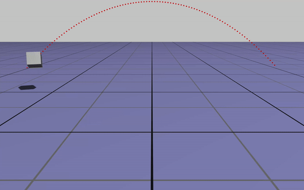
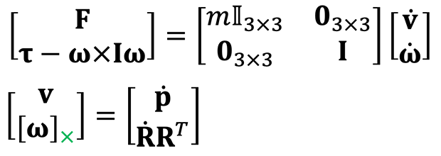
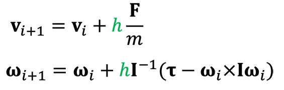
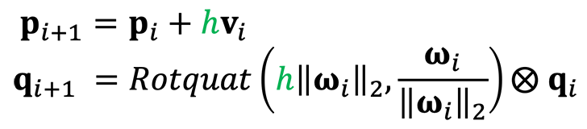
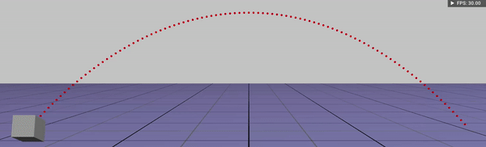
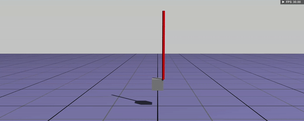
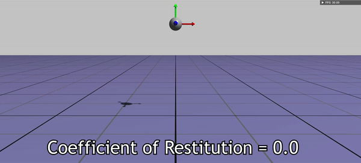

# Assignment 5 - Rigid bodies 

**Hand-in:** May 13, 2022, 18:00 CEST

----

Leave your name, student ID, ETH email address and URL link to demo video here.

- Name:
- Student ID:
- ETH Email:
- Your Answer for Ex.1:

----

In this assignment, we will make a rigid body simulator somewhat like this.


*Figure 1: rigid body simulations. Videos from [MobyMotion](https://www.youtube.com/c/MobyMotion), [NVIDIA](https://youtu.be/1o0Nuq71gI4).*

Okay, to be honest, it's actually more like this. Does it look boring? Believe me, what they do are fundamentally the same.



*Figure 2: the rigid body simulator that we will create.*

## Hand-in and Evaluation

Once you complete this assignment you should hand in
- code pushed to your github repository.
    
The grading scheme is as follows
- baseline (80 %): based on your code, your answer in README (Ex.1).
- advanced (20 %): based on your code and a demo video. 
- your implementation will be evaluated by an auto grading system **after the deadline**. (the test sets are **not visible** to you)

**IMPORTANT:** If your code is not built successfully, you will get **zero** point from this assignment. So make sure
your code is built without any build/compile error.

**IMPORTANT:** If the system detects a suspected plagiarism case, you will get **zero** point from this assignment.

Please leave your questions on GitHub, so your colleagues also can join our discussions. 

## Exercises

Okay now let's do this step-by-step :) Please note, from now on, we will assume every rigid body object has a same mass and a same dimension (for simplicity. Of course it's pretty straight-forward to extend this for more general cases).

### Ex.1 Explicit Integration (baseline - 40%)

What is a rigid body simulator? What does it do? In fact, it's nothing but a solver that find a solution of the following equations:



where **v**, **w**, **p**, **R** are the linear velocity of the center of mass of a rigidbody, the angular velocity, the position and the orientation (3x3 rotational matrix) respectively (note that they are all expressed in world frame!) *m* and **I** denote mass and moment of inertia (expressed in world frame) of the rigid body. We want to find **v**, **w**, **p**, **R** at time *t*, given profile of external force **F** and torque **t**. 

If we use an unit quaternion for orientation instead of a rotational matrix and discretize this equation, we get: 





where *h* is a timestep of the simulation. Note that here, we use the explicit (forward) Euler method.

Your very first task is to implement this numerical integration step in ```src/libs/sim/include/sim/RBExplicitEngine.h``` and ```src/libs/sim/include/sim/RBEngine.h```. Again, we are going to use explicit (forward) Euler method. For now, let's just assume that only gravity is a source of external force. 

**Task:**
- Implement explicit Euler integration for ```Projectile``` simulation.
- State **what** (5%) happens if you change the timestep size of simulation (you can change the timestep size on UI of ```rigidbodies`` app), and also reason **why** (5%) this happens (in 1 sentence for each.)
  - **IMPORTANT**: Leave your answer on the top of this README file!
  - **Hint**: The red trajectory rendered in screen is *analytic* trajectory, which you can consider as the ground-truth.

**Details:**
- Complete ```Quaternion updateRotationGivenAngularVelocity(const Quaternion &q, const V3D &angularVelocity, double dt)``` function in ```src/libs/sim/include/sim/RBEngine.h``` for updating orientation of rigidbody given timestep ```dt``` and ```angularVelocity``` (10%.)
- Complete ```void step(double dt)``` function of ```RBExplicitEngine``` in ```src/libs/sim/include/sim/RBExplicitEngine.h``` (20%.)

Once you complete the implementation, run ```rigidbodies``` app, select **Projectile** for simulation scene, select **Explicit** for simulation engine from GUI, and play (or just tap **SPACE**). You should see something like this: 



*Figure 3: the rigid body simulation that we will create.*

Okay, if your projectile simulation works properly, change the simulation rate and notice how the trajectory of the rigidbody changes. **What** do you notice (5%) and **why** it happens (5%)? **Leave your answer on the top of this README in a single sentence for each question.**

### Ex.2 Springs (baseline - 20%)

Okay, now let's add some external force sources: we will create springs in the simulation scenes. 

Your task is implementing your logic for spring forces that are applied from 
- Ex.2-1 (10%): a spring fixed to the world: one end of spring is attached to a rigidbody while another end is attached to some fixed point. 
- Ex.2-2 (10%): a spring which of both ends are attached to rigidbodies.  

Every spring has a same spring constant, and its force is linear to displacement i.e. f = -k(x-x<sub>0</sub>). 

**Task:**
- Implement springs for ```Fixed Springs``` and ```Rigid Body Springs``` simulation.

**Details:**
- Complete ```RBSpring *addSpringToEngine(RB *parent, RB *child, P3D pJPos, P3D cJPos)``` function in ```src/libs/sim/include/sim/RBEngine.h``` for creating a spring attached to rigidbodies parent and child. 
  - ```pJPos``` and ```cJPos``` are the points where the spring is attached to ```parent``` and ```child``` respectively.
  - if ```pJPos``` is ```nullptr``` that means, the one end of spring is attached to a virtual fixed point which of the world position is ```pJPos```.
  - **IMPORTANT:** the rest length (initial length of the spring that generate zero force) of the spring is the distance between attached points when the spring is added.
- Complete ```void updateForceAndTorqueForSprings()``` function in ```src/libs/sim/include/sim/RBEngine.h``` for computing spring force.

Once you finish your implementation, run ```rigidbodies``` app, select **Fixed Springs** or **Rigid Body Springs** in simulation scene menu, and select **Explicit** for simulation engine from GUI, and play the simulation... oh wait, something bad thing is happening!



*Figure 4: The simulation is blown up!*

### Ex.3 Stable Simulation (baseline - 20%)

Well, in fact, this is super normal. I hope you already figured out what the problem is. If not... I will give you a hint. Did you notice that the trajectory of the projectile object (in **Projectile** scene) differs from the analytical trajectory (the red trajectory)? Why the simulated trajectory computed by the Explicit integration reaches higher points than the analytical one?     

Okay, if you know why, then it's pretty clear what we need to do for making our rigid body simulator more stable. Your task is making our simulator stable enough so that we can simulate springs with *dt = 1/30* (simulation rate, 30Hz). We are going to use the **symplectic Euler** method. 

**Task:**
- Implement symplectic Euler integration.

**Details:**
- Complete ```void step(double dt)``` function of ```RBSymplecticEngine``` in ```src/libs/sim/include/sim/RBSymplecticEngine.h``` (20%.)

Once you are done, select **Symplectic** for simulation engine, select **Projectile**, **Fixed Springs** or **Rigid Body Springs** in simulation scene menu, and again, change the timestep *dt* and see what happens (this question is not for points, and you are free to discuss with your colleagues).

### Ex.4 Impulse-based Collisions (advanced - 20%)

Well, it looks good already, but you may not be very happy that the rigidbody objects go through the ground. Well, we can give a slight more effort to simulate collisions between objects. For simplicity, let's simulate collisions between a spherical rigid body and ground only. 

Read the material, [ImpulseBasedCollisions](http://crl.ethz.ch/teaching/computational-motion-21/slides/ImpulseBasedCollisions.pdf) from our course website, see the comments in ```src/libs/sim/include/sim/RBEngine.h``` (read the comments very carefully!), and implement impulse-based collision simulation logic for **restitutional** contact. Note that we assume 
- a collision only happens at the bottom of a sphere 
- there's only one contact between a sphere and the ground
- the radius of the sphere is 0.1 m

We are going to implement both **frictionless** collision (10%) and **infinite friction** collision (10%.)  

**Task:**
- Implement both **frictionless** and **infinite friction** impulse-based collision. 

**Details:**
- Complete ```void updateVelocityAfterCollision(RB *rb)``` function in ```src/libs/sim/include/sim/RBEngine.h```.

Once you finish your implementation, run ```rigidbodies``` app, and select **Collisions** from simulation scene dropdown menu. Now, play around with different restitution values by adjusting **epsilon**. You may see somewhat like this:



*Figure 5: restitutional collision simulations with dt = 1/30*

If you want to test frictional collision, check **init angular velocity** check box. And turn on/off **friction** check box to compare the difference in collision behaviors. 
You may want to change **epsilon** into roughly 0.7 to see the difference more clearly.

## Final Note

You might notice that, the behaviors of the collisions are still a bit unrealistic (can you explain why it's unrealistic, and why it happens? Please feel free to discuss with your colleagues).

In fact, contact/collision simulation is not straight-forward, and it is still an active research topic. Today, we just used a very simple model that can give you some idea of how a rigid body simulation pipeline works. If you are interested, see the following materials about collision simulations:
- [An Introduction to Physically Based Modeling: Rigid Body Simulation II — Nonpenetration Constraints](https://www.cs.cmu.edu/~baraff/pbm/rigid2.pdf)
- [Video Game Physics Tutorial - Part III: Constrained Rigid Body Simulation](https://www.toptal.com/game/video-game-physics-part-iii-constrained-rigid-body-simulation)